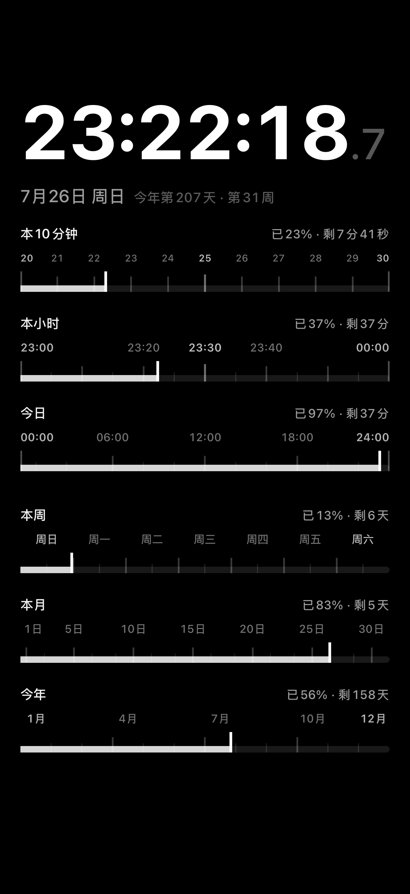

# PressureClock · 时间压力钟

一个极简的 macOS / iOS 时钟:大字报时之下,用一组冷静的进度条告诉你——**本 10 分钟、本小时、今天、本周、本月、今年,已经流逝了多少,还剩多少。**

A minimal time-pressure clock for macOS & iOS: a big clock plus calm progress bars showing how much of the current 10-minute block / hour / day / week / month / year has already slipped away.

<p align="center">
  
</p>

## 理念

它解决的不是"现在几点"的信息缺失,而是**注意力麻木**:时钟提供时刻感,进度条提供损耗感。没有红色警报、没有弹窗打断、没有游戏化——只有持续、冷静、不可逆的进度条,和右上角一句"已 93% · 剩 1 小时 27 分"。

## 功能

- 六个内置维度:本 10 分钟 / 本小时 / 今日 / 本周 / 本月 / 今年(另有本世纪与自定义区间)
- 每行右侧显示压迫感读数:**已 X% · 剩 Y**
- 日期行附带"今年第 N 天 · 第 N 周"
- 所有进度基于真实日历区间计算(闰年、大小月、周起点都算对),核心逻辑有单元测试覆盖
- **macOS**:普通窗口 / 置顶悬浮切换,窗口位置大小记忆,背景透明度可调
- **iOS**:全屏黑底常亮显示,适合立在桌面或床头当"压力钟"
- 双端共享同一套核心代码(计算、模型、格式化、进度条渲染),平台差异仅靠少量条件编译

## 构建

依赖 [XcodeGen](https://github.com/yonaskolb/XcodeGen):

```bash
xcodegen generate
open DesktopTimePressureClock.xcodeproj
```

| Target | 平台 | 说明 |
|---|---|---|
| `DesktopTimePressureClock` | macOS 14+ | Mac 版(产品名 PressureClock) |
| `PressureClockMobile` | iOS 17+ | iOS 版 |
| `DesktopTimePressureClockTests` | macOS | 核心计算的单元测试 |

真机安装 iOS 版需在 `project.yml` 中把 `DEVELOPMENT_TEAM` 换成你自己的开发者团队。

运行测试:

```bash
xcodebuild -project DesktopTimePressureClock.xcodeproj \
  -scheme DesktopTimePressureClock -destination "platform=macOS" test
```

## 目录

```text
DesktopTimePressureClock/   核心代码 + Mac 端(计算/模型/视图/设置)
iOSApp/                     iOS 入口与主视图
DesktopTimePressureClockTests/  单元测试
SPEC.md                     产品规格(中文)
scripts/                    Mac 版打包脚本(zip/dmg)
```

## License

MIT
